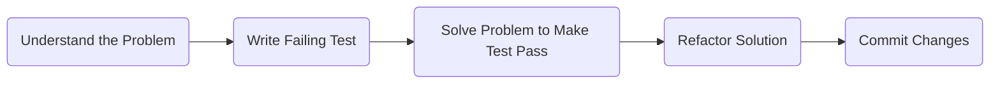
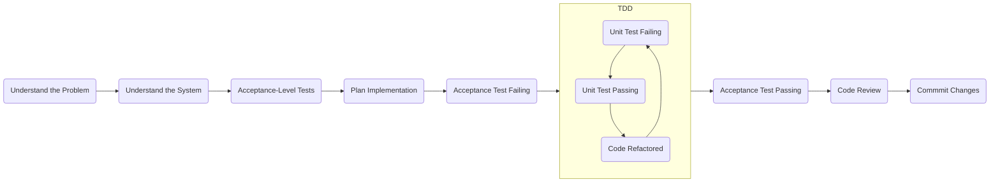

> These are notes, lessons, and takeaways from [The Senior Software Engineer](https://www.goodreads.com/en/book/show/18215039)

## Focus on Delivering Results

> A senior software engineer is trusted and expected to do the most important work and to do it reliably. The way to accomplish that is to focus everything you do on the delivery of results.

- Results
- Focus
- Deliver smaller results more often
- Plans, schedules, and status reports

## Fix Bugs Efficiently and Cleanly

1. Understand the problem.
2. Write tests that fail (because the problem has yet to be solved).
3. Solve the problem as quickly as you can, using your tests to know when you’ve solved it.
4. Modify your solution for readability,conciseness,and safety by using your tests to make sure you haven’t broken anything.
5. Commit your changes.

Thinking before coding.

Separating “getting it to work” from “doing it right”. It’s hard to do both at the same time.

### Understand the Problem

These notions are very much in line with our focus on delivering results, however they can often be misinterpreted as
“just start coding”.

By rushing into coding up a solution, you run the risk of solving the wrong problem, or wasting time pursuing a partial solution. Any work you do to solve the wrong problem is wasted effort that must be undone. Further, the amount of time required to re-do the work later is orders of magnitude higher than taking a bit of time now to understand what you need to do.

These issues can easily be addressed by taking a breath and thinking for a few moments. “No Big Design Up Front” doesn’t mean “No Design” any more than “code wins arguments” means “coding is the only activity worth doing”.

If you’re fixing a bug, the easiest way to understand the problem is to actually use the buggy software and see the problem yourself. Even if you think you know the exact line of code where the problem occurs, actually seeing the bug as a user would can be hugely insightful. It may turn out that the line of code you thought you’d have to change is perfectly correct and some other part of the system is doing something wrong.

**Roadblocks**

- Misunderstanding the problem
- No access to the production system
- No access to project stakeholders
- An acutal emergency or business priority
- Pressure to immediately start coding

### Write Tests That Fail

- Automated testing
- Write tests first

**Roadblocks**

- There is no existing test suite
- No infrastructure for tests at the "level" you need to test

### Solve the Problem as Quickly as You Can

With tests failing, you should now get them to pass as expediently as you can. Don’t spend a lot of time pondering the “right” solution or making things “elegant”. Just get the system working.

**Roadblocks**

If you do any pair programming, your pair might take is- sue with your tactic of coding without regard to cleanliness, style, or maintainability. Simply remind your pair that once things are working, you can use the test suite to keep things working while you clean everything up.

### Modify Your Code for Maintainability and Readability

- No copy and paste code
- Descriptive variable names
- Coding style should match the existing code

Don't over-engineer and know when to quit.

Refactoring is restructuring an existing body of code, altering its internal structure without changing its external behavior

**Roadblocks**

When pair-programming, this step might result in more discussion. This can be a good thing since if two programmers can agree that a particular refactoring is good, chances are it is.

### Commit Your Changes

The first line of your commit message should state, as briefly and specifically as possible, what the change is.

## Add Features with Ease

1. Understand the problem
2. Understand the system
3. Create acceptance-level tests for the feature
4. Plan your implementation
5. Repeat the cycle from the previous chapter until all your acceptance-level tests pass
6. Get a code review
7. Commit your changes

### Understand the Problem

If you have not been given a UI mockup or are expected to produce the UI on your own, schedule two meetings with your user/stakeholder: one to talk through the business problem, and a second to talk through the UI. If you are new to creating UI mockups, just keep it simple. Often a drawing on a piece of paper is sufficient to work out how something should look, but there are many web-based and desktop tools to create UI mockups.

**Roadblocks**

- Stakeholder is not available/accessible

### Understand the System

Now that you understand the business problem you are solving and the way in which the user will interact with the system to do so, you need to develop a system view of the application you’ll need to modify.

- What domain objects will this feature need to interact with?
- What business rules exist around those objects?
- What structures are in place to manage those objects?
- What new objects will you need to create?
- What is the test coverage like? Will you need to add test coverage anywhere before making changes?
- Are there any offline tasks related to these objects?
- Is there special reporting or auditing on the changes related to these objects, and should your new objects be a part of this?
- Are there non-functional requirements to consider, such as performance or security?

**Roadblocks**

- Pressure to immediately start coding

### Create Acceptance-Level Tests

