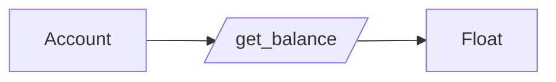

## Getting Started

There is a full [Getting Started Guide](https://gleam.run/getting-started/) available from Gleam.

## Try It Out

If you just want to try out Gleam without installing anything, you can use the [online playground](https://johndoneth.github.io/gleam-playground/). In this series, we will be building an application, so I'm going to install Gleam locally.

## Installing Gleam

I'm working on a Mac, so I will be using Brew. Installation on other operating systems is covered in the Getting Started Guide from Gleam. Gleam is available though many package managers, including asdf and nix.

```sh
brew update
brew install gleam
```

## Verifying Installation

Brew took care of updating Erlang for me, because I already had it installed previously as a dependency for Elixir. Brew should take care of installing and dependencies automatically, but if you run into a problem running the following command, then installing Erlang using Brew with resolve this.

```sh
erl -version
# Erlang (SMP,ASYNC_THREADS) (BEAM) emulator version XX.XX.XX
```

## A Note About PATH

The `PATH` environment variable is where Unix-like systems, such as Mac, search to find binaries when attempting to run commands. Because I already have the location of my Brew packages in my Path, I did not have to deal with this problem. If you do happen to run into this issue, then you will want to fix it by adding the path to the Erlang binary to your Path, which is covered in the Getting Started Guide from Gleam.

## Creating a New Project

```sh
gleam new bam
cd bam
gleam test
```

## Hello World!

**`src/bam.gleam`:**

```gleam
import gleam/io

pub fn main() {
  io.println("Hello from bam!")
}
```

```sh
gleam run
# Hello from bam!
```

## What is BAM?

[Bank Account Manager (BAM)](https://github.com/tacoda/bam) is a simple project that can get us up-and-running with Gleam. This is a toy project that can start with a very small amount of functionality and still have the room to increase complexity by adding arbitrary features. It is complex enough that we will need to work with **all** aspects of writing programs. Thus, in this series we will:

- Write documentation
- Write tests
- Build packages
- Refactor
- Consider tradeoffs
- Discuss best-practices

## Look at the Tests!

**`test/bam_test.gleam`:**

```gleam
import gleeunit
import gleeunit/should

pub fn main() {
  gleeunit.main()
}

// gleeunit test functions end in `_test`
pub fn hello_world_test() {
  1
  |> should.equal(1)
}
```

```sh
gleam test
# .
# Finished in 0.XXX seconds
# 1 tests, 0 failures
```

Any good test should describe the cases well enough to get an understanding of the behavior of the code under test. Good tests should serve as executable documentation. In the hello world test, we see an assertion that `1 |> should.equal(1)`. This is pretty straight-forward.

> **Side Note:** I _really_ like this pipe syntax. It's one of my favorite things about Elixir and I'm glad to see it show up here.

## Type-Driven Development

Gleam's type system makes me nostalgic of an idea that I learned while learning Scheme, while reading [How to Design Programs](https://htdp.org/2003-09-26/Book/). This idea is [Design by Contract](https://htdp.org/2003-09-26/Book/curriculum-Z-H-5.html#node_sec_2.5). The reason that I like this idea so much is that it makes our code _well-defined_, which means that it is unambiguous!

> If you are interested in How to Design Programs, you should use the [Second Edition](https://htdp.org/2022-8-7/Book/index.html).

Here is my initial `Account` type:

```gleam
pub type Account {
  Account(balance: Float)
}
```

Now that we have the `Account` type, we can drive out a simple getter function.

```gleam
pub fn get_balance(account: Account) -> Float {
  account.balance
}
```

This function really appeals to my inner mathematician. It is _well-defined_, unambiguous, explicit in all the right places, and omissive in all the right places. From this code, we can gather a lot of information:

- `get_balance` is a public function
- It accepts one argument of type `Account`
- It returns a `Float`



Here is what I appreciate about these things: I don't have to test them! I can trust they will always be true because they are part of the definition of the code. I don't have to worry about edge cases with types (only with content). And, better yet, if I write code that fails to fulfill these requirements, then it simply fails to compile.

## Wire Up `main`

```gleam
pub fn main() {
  let account = Account(1.0)

  account
  |> get_balance
}
```

This is enough to get us going. Here, we create an Account using a constructor and then print out the balance.

```sh
gleam run
```

## Takeaways

- Good tests should serve as executable documentation
- Designing by contract results in unambiguous code, which increases confidence

---

**Next up:** We will start to build out basic functionality for banking accounts.
