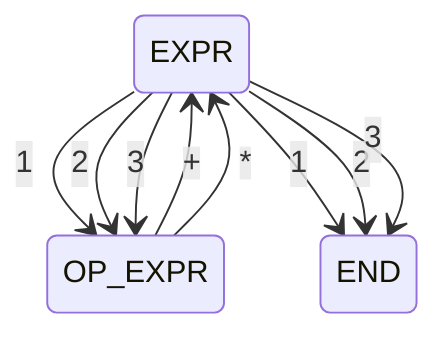

## Regular Languages

The [Chomsky Hierarchy](https://en.wikipedia.org/wiki/Chomsky_hierarchy) is a containment hierarchy of formal grammars.


```
(
    [123]
    [+*]
)*
[123]
```

Turn expression into grammar

```
EXPR = NUM
EXPR = NUM OP EXPR
```

This is a regular grammar because it came from a regex

We need to put the expression into a regular form
THis will be a right regular grammar

```
RULE1 = '1'
RULE2 =  '1' RULE2
```

### Right Regular Grammar

```
EXPR = '1'
EXPR = '2'
EXPR = '3'
EXPR = '1' OP_EXPR
EXPR = '2' OP_EXPR
EXPR = '3' OP_EXPR
OP_EXPR = '+' EXPR
OP_EXPR = '*' EXPR
```

### Finite State Machine



## POSIX

POSIX Basic Regular Expressions

## PCRE

When a developer refers generally to _regular expressions_, they are usually referring to **PCRE** &mdash; Perl Compatible Regular Expressions. These are the regular expressions that you will find almost everywhere, because they are POSIX-compliant.

## Pomsky

[Pomsky](https://pomsky-lang.org) is a language that compiles to regular expressions. It is currently in an alpha stage and will likely change in the next few releases. Pomsky covers all of the usual cases of regular expressions, but with a syntax that is less terse and more semantic.

### Variables

Pomsky has variables, which takes us one step away from a finite state machine.

```
let operator = '+' | '-' | '*' | '/';
let number = '-'? [digit]+;

number (operator number)*
```

## Some Examples

| Meaning | POSIX | PCRE | Pomsky | Accepted | Rejected |
|---|---|---|---|---|---|
| The word `hello` | `'hello'` | `'hello'` | `'hello'` | hello | bye |
| Word character followed by a space and new line | `\w\s\n` | `\w\s\n` | `[word] [space] [n]` | 'a ⏎' | 'a⏎' |

