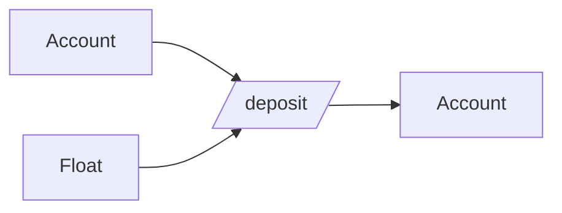
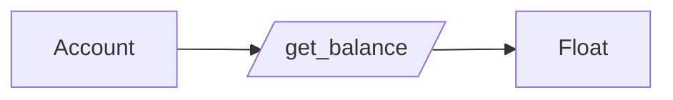
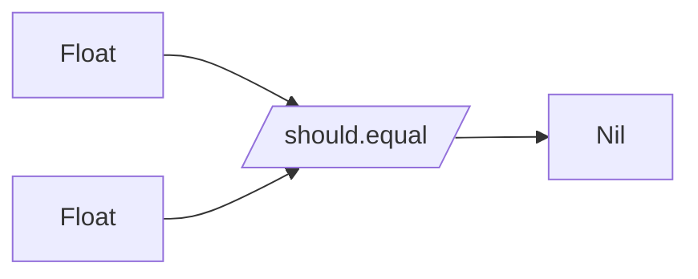
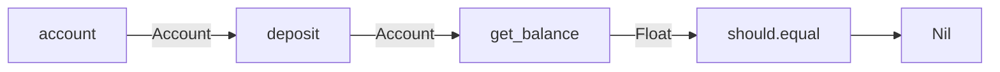

## Our Initial State

**`src/bam.gleam`:**

```gleam
import gleam/io

pub type Account {
  Account(balance: Float)
}

pub fn get_balance(account: Account) -> Float {
  account.balance
}

pub fn main() {
  let account = Account(1.0)
}
```

```sh
gleam run
```

This code works, but doesn't do much and it's hard to determine that it _is_ succeeding through intuition. Instead, one would have to look at exit codes. Additionally, it is _not_ exercising our `get_balance` function, which is a pretty blatant fault. So, let's build this out a little more to get some text feedback in the terminal.

## `io.println`

We will start off by using a function given to us by our _hello world_ application. Let's start printing!

First, we'll print out the value of the Account:

```gleam
pub fn main() {
  let account = Account(1.0)
  io.println(account)
}
```

```sh
gleam run
# Expected type:
#
#     String
#
# Found type:
#
#     Account
```

**Woah!** What's going on here? Well, recall that Gleam has strong static types. This helpful little error message is telling us that we're using the function with the wrong type for the argument.

Alright, so let's fix that.

```gleam
pub fn main() {
  let account = Account(1.0)
  io.println(get_balance(account))
}
```

```sh
gleam run
# Expected type:
#
#     String
#
# Found type:
#
#     Float
```

**Again?** Well, yes. Again, we did not give it the type it expected. In other languages, the interpreter or compiler may automatically coerce one type to another. Not here. And this is a great thing! Compile errors are better than tests. Tests are better than bugs. In short, Gleam's types help us to ensure that we don't push code that will fail.

> **Note:** Just because we have more confidence with types, does not mean that we can write code without faults. The type system will catch type errors, but it will _not_ catch logic errors.

Okay, let's convert the string to a float. We can do that using the [`to_string`](https://hexdocs.pm/gleam_stdlib/gleam/float.html#to_string) function in the **gleam/float** module.

Let's drop this into place:

```gleam
import gleam/float

pub fn main() {
  let account = Account(1.0)
  io.println(to_string(get_balance(account)))
}
```

```sh
gleam run
# The name `to_string` is not in scope here.
```

Gleam cannot find `to_string` here because it does not know the module to look in. Let's make the call to the function explicit:

```gleam
import gleam/float

pub fn main() {
  let account = Account(1.0)
  io.println(float.to_string(get_balance(account)))
}
```

```sh
gleam run
# 1.0
```


## The Pipes are Calling

This line of code is painful to look at:

```gleam
io.println(float.to_string(get_balance(account)))
```

Let's write this in a cleaner way using pipes! Pipes allow you to send the output of one function into the next function as the first argument. If you are familiar with Elixir pipes or JavaScript promises, this should seem familiar.

```gleam
account
|> get_balance
|> float.to_string
|> io.println
```

## Take My Money!

Now that we have a basic program working and we have cleaned up the code a little, we can start driving out the first real feature: deposits. Before we get started, here's a quick snapshot of what our code looks like:

**`src/bam.gleam`:**

```gleam
import gleam/io
import gleam/float

pub type Account {
  Account(balance: Float)
}

pub fn get_balance(account: Account) -> Float {
  account.balance
}

pub fn main() {
  let account = Account(1.0)

  account
  |> get_balance
  |> float.to_string
  |> io.println
}
```

**`test/bam_test.gleam`:**

```gleam
import gleeunit
import gleeunit/should

pub fn main() {
  gleeunit.main()
}

// gleeunit test functions end in `_test`
pub fn hello_world_test() {
  1
  |> should.equal(1)
}
```

### Glee Who?

[Gleeunit](https://hexdocs.pm/gleeunit/gleeunit.html) is a testing framework for Gleam. It uses Erlang's EUnit test framework. From hexdocs, we learn:

> Any Erlang or Gleam function in the `test` directory with a name editing in `_test` is considered a test function and will be run.

Gleeunit runs any module in the `test` directory that ends with `_test.gleam`.

## Adding The First Test

First, we will remove the `hello_world_test`. The initial test we will start with is adding a valid, positive value to the account balance.

```gleam
pub fn deposit_increases_account_balance_test() {
  let account = Account(0.0)
}
```

```sh
gleam test
# No module has been found with the name `Account`.
```

Here Gleam is telling us that it cannot find the `Account` name. Let's import the module to fix this.

```gleam
import bam
```

```sh
gleam test
# No module has been found with the name `Account`.
```

🤨 Why didn't this work? Because Gleam still doesn't know what an `Account` is. One way to resolve this is to prefix the module name (e.g., `bam.Account`). Instead, we'll add the type to the import statement.

```gleam
import bam.{Account}
```

```sh
gleam test
# .
# Finished in 0.XXX seconds
# 1 tests, 0 failures
```

**Green tests!** Time to call it a day!

## Just Kidding

Our test is not testing _anything_ at the moment, so let's make it assert things.

> Given an account initialized with `0.0`, when I deposit `N` currency, then I expect to have a balance of `N`.

Now we will convert this statement into some Gleam code:

```gleam
import gleeunit
import gleeunit/should
import bam.{Account}

pub fn main() {
  gleeunit.main()
}

pub fn deposit_increases_account_balance_test() {
  let account = Account(0.0)

  account
  |> deposit(10.0)
  |> get_balance
  |> should.equal(10.0)
}
```

```sh
gleam test
# The name `deposit` is not in scope here.
```

We know this story, except that this is the new function that has not yet been defined. Let's blindly apply the fix we had before to see what results.

```gleam
import gleeunit
import gleeunit/should
import bam.{Account, deposit}

pub fn main() {
  gleeunit.main()
}

pub fn deposit_increases_account_balance_test() {
  let account = Account(0.0)

  account
  |> deposit(10.0)
  |> get_balance
  |> should.equal(10.0)
}
```

```sh
gleam test
# The module `bam` does not have a `deposit` field.
```

Gleam is attempting to find `deposit` and since we have not yet defined it in our code, Gleam tries to resolve this with fields, and then subsequently cannot find it. Now that we know what these errors look like, let's go define that `deposit` function:

**`src/bam.gleam`**:

```gleam
pub fn deposit(account: Account, amount: Float) -> Account {
  Account(account.balance + amount)
}
```

```sh
gleam test
# The + operator expects arguments of this type:
#
#     Int
#
# But this argument has this type:
#
#     Float
#
# Hint: the +. operator can be used with Floats
```

More type issues! But this one is pretty obvious.

> **Note:** I'm happy with this choice. While I have to pay attention to my numeric types when using operators, there are certain cases that I know will never be a problem, such as accidentally performing integer division.

```gleam
pub fn deposit(account: Account, amount: Float) -> Account {
  Account(account.balance +. amount)
}
```

```sh
gleam test
# The name `get_balance` is not in scope here.
```

We've seen this before:

```gleam
import bam.{Account, deposit, get_balance}
```

```sh
gleam test
# .
# Finished in 0.XXX seconds
# 1 tests, 0 failures
```

**Green tests!**

## But What Does It Mean?

Let's take a closer look at this assertion:

```gleam
  account |> deposit(10.0) |> get_balance |> should.equal(10.0)
```

What's going on here? Well, the `account` is in scope from a `let` statement. It is assigned a value of `Account(0.0)`.

### Linguistic Perspective

> **Given** an account with a zero balance \
> **When** `10.0` currency is `deposit`ed into that account \
> **Then** `get_balance` for that account `should.equal` `10.0`

### Data-Driven Perspective

Data Type Flow for `deposit`:



Data Type Flow for `get_balance`:



Data Type Flow for `should.equal`:



> **Note:** Here we are using specific types to assert equality. How does `should.equal` compare different types successfully? Because it uses _Generic Types_. We will explore this more. In this case, we are using the float _"version"_ of `should.equal`.

### Process-Driven Perspective



## Takeaways

- Strong types are not an impediment to test-driven development
- Leverage Gleam's types to constrain the test space

---

**Next up:** We will add more tests and create a better way of creating accounts.
